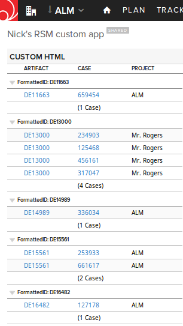

SF cases
=========================

## Overview

This app extracts Salesforce case URLs created in Rally by Rally-Salesforce integration and builds a grid of those cases
grouped by Rally artifact those cases related to.

Rally-Salesforce integration uses a WebLink type of custom field to reference a related Salesforce case.

Two limitations of this integration are relevant in this context: 

1) WebLink fields are not queriable. 

2) Even if a Rally defect is linked to more than one Saleseforce case, only the first related case reference populates the WebLink filed.

Since we cannot count on WebLink type custom field to give us all cases related to a given defect, the app parses Discussion collections on artifacts.
This is possible because each Salesforce case linked to the defect triggers creation of a ConversationPost.
(In WS API Discussions are collections of ConversationPost objects.)

The app parses ConversationPosts to identify and extract html 'a href' attribute to populate CASE column.

(Another alternative would be to parse Revisions, but that would be even more resource-intensive).

IMPORTANT: It's strongly recommended that the user keeps the filter by CreationDate of the ConversationPosts narrow to limit the volume of data that is being parsed. Currently the app looks 90 days back.

Note: The app traverses from ConversationPost to Artifact. It does not hydrate the Artifact to get to a particular type, e.g. Defect to avoid additional WS API requests. Since custom fields specific to Salesforce integration exist on Defect object, and not on its parent Artifact, the app does not access those fields. Instead of using 'c_NumberofCases' the app uses ExtJS grid's count feature. This also avoids a possible discrepancy between the number returned by 'c_NumberofCases' and the actual number of Salesforce cases grouped under every artifact in the grid due to a time window restricted by CreationDate filter, which may leave some cases outside of the date range.

## License
This app is available AS IS. It is not supported by Rally Support.
AppTemplate is released under the MIT license.  See the file [LICENSE](./LICENSE) for the full text.

##Documentation for SDK

You can find the documentation on our help [site.](https://help.rallydev.com/apps/2.0rc3/doc/)
